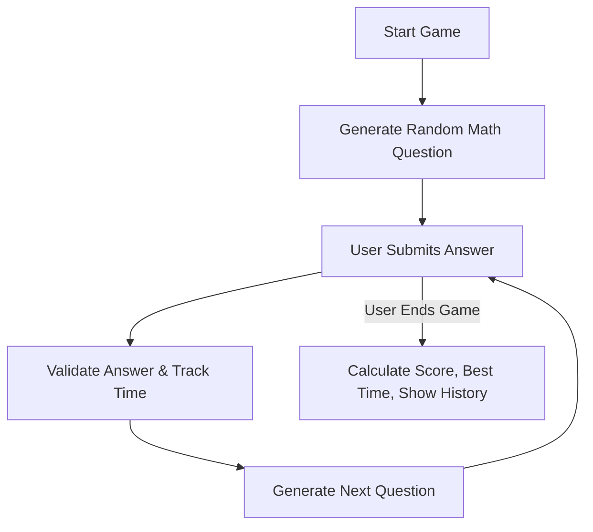

# 🧠 Dev Mind Speed Game API  
*A Backend Task Submission for Circa*

Welcome to **Dev Mind Speed**, a high-speed mental math game built entirely as a **backend API**. Players solve dynamically generated math questions via **API requests** using tools like **Postman** or **Swagger UI**, with the system tracking accuracy and response times — no frontend needed.

---

## 📌 Overview

This project is built with **Python 3.12**, **FastAPI** and **MongoDB** following the given technical brief. It includes:

- Full game session handling
- Random equation generation based on difficulty
- Precise answer validation
- Real-time score tracking
- Session history logging
- MongoDB storage and FastAPI backend

---

##  Tech Stack

| Tech        | Description                     |
|-------------|---------------------------------|
|  Python 3.12 | Main programming language     |
|  FastAPI   | Web framework for APIs          |
|  MongoDB   | NoSQL database to store sessions |
|  UUIDs     | For unique game identification |
|  Swagger UI | Built-in testing interface     |

---

##  Game Flow Summary

## Sample API Requests (for Postman or Swagger)

- 1- Start a New Game POST /game/start
    - {
    - "name": "Osama",
    - "difficulty": 2
    - }

- 2- Submit an Answer POST /game/{game_id}/submit
    - Replace {game_id} with the actual game ID you receive
    - {
    - "answer": 42.0
    - }
- 3- End the Game GET /game/{game_id}/end
    - Just use the same game ID .
---
##  Setup Instructions

- Clone the project
   - git clone https://github.com/osama-al-khreishah/circa_game.git
   - cd circa_game
- Create a virtual environment
    - python -m venv venv
    - source venv/bin/activate  # Windows: venv\Scripts\activate
- Install dependencies
    - pip install -r requirements.txt
- Create .env file
    - MONGO_URL=mongodb://localhost:27017
- Run the app
    - uvicorn app.main:app --reload
- Now open your browser to:
    -  http://127.0.0.1:8000/docs

---

## Author
**ENG. Osama Mohammad Al-Khreishah**

 *BSc. in Intelligent Systems Engineering*

 osamakhreishah@gmail.com